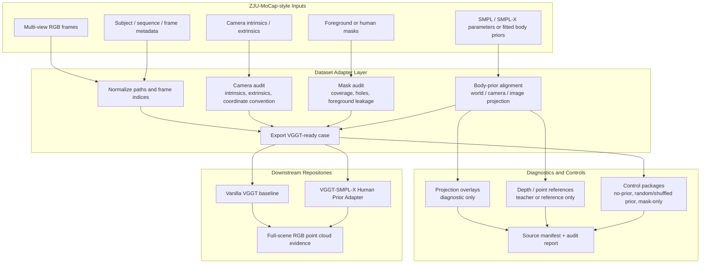
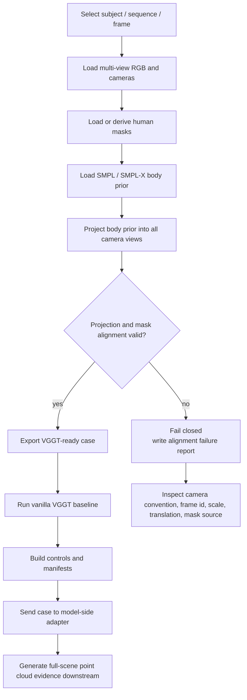
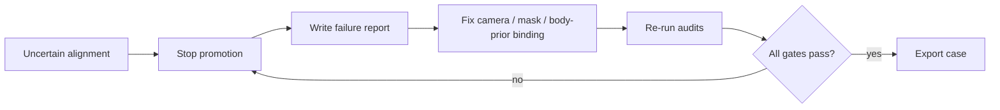

# VGGT-ZJU-MoCap Adapter

A dataset-bridge and evidence-auditing repository for using **ZJU-MoCap-style multi-view human data** in a **VGGT + SMPL-X human-prior reconstruction workflow**.

This repository is not the final model-side adapter. Its main role is to prepare, validate, and audit the data needed by the VGGT human-prior route: multi-view RGB, cameras, masks, SMPL/SMPL-X-aligned geometry, projected prior evidence, baseline VGGT outputs, and control comparisons.

---

## Project Position

This repository is the **ZJU-MoCap data bridge** in the VGGT + SMPL-X project family.

| Repository | Role |
|---|---|
| `VGGT-SMPL-X-Human-Prior-Adapter` | Model-side adapter: SMPL-X prior injection, VGGT token/feature route, training losses, student output. |
| `VGGT-ZJU-Mocap-Adapter` | ZJU-MoCap bridge: multi-view data conversion, camera/mask/body-prior alignment, diagnostics, evidence manifests. |
| `vggt_for_4k_4d` | 4K4D/DNA-Rendering-oriented case preparation and full-scene RGB point cloud evidence packaging. |

The key goal of this repository is to make the dataset side reliable enough that downstream model results can be judged fairly. If camera binding, mask alignment, pose conversion, or coordinate systems are wrong, the model route can produce misleading metric improvements while still failing visually.

---

## Core Principle

The ZJU-MoCap adapter should act as an **observation and alignment layer**, not as a final-result generator.

It may produce:

- aligned camera metadata,
- per-view RGB/mask packages,
- projected SMPL/SMPL-X diagnostics,
- baseline VGGT inputs,
- teacher/reference geometry for supervision or checking,
- manifests and failure reports.

It must not package teacher-only geometry, SMPL-only renderings, or projection overlays as a successful VGGT student result.

---

## High-Level Architecture



---

## Why This Adapter Matters

VGGT is sensitive to multi-view geometry consistency. Human-prior integration is even more sensitive because the prior must line up with the real person in every view.

This repository therefore focuses on the failure modes that can silently break the downstream model:

- wrong camera coordinate convention,
- frame-index mismatch,
- mask leakage or missing body parts,
- SMPL/SMPL-X pose in the wrong coordinate system,
- projection overlay that looks acceptable in 2D but fails in 3D,
- teacher geometry being mistaken for model output,
- dataset-specific shortcuts that do not generalize.

---

## Data Bridge Workflow



---

## Evidence Rules

This repository should help enforce, not bypass, the evidence gates of the wider project.

### Teacher / Reference / Student Boundary

| Artifact | Role | Promotion status |
|---|---|---|
| Projected SMPL/SMPL-X overlay | Alignment diagnostic | Cannot be final evidence. |
| Masked body crop | Diagnostic or input preparation | Cannot be final evidence. |
| Dense depth or fused reference | Teacher/reference | Cannot be final student result. |
| Vanilla VGGT output | Baseline | Used for comparison. |
| Adapter output from model-side repo | Student candidate | Must pass visual gates downstream. |

### Required Visual Standard

The final advisor-facing evidence must be produced downstream as a **human-main full-scene RGB point cloud**, not an isolated ZJU body crop. The human should be readable by eye in 3D while preserving enough environment or scene context to prove it remains a scene-level VGGT output.

---

## Recommended Export Contents

A reliable exported case should contain:

```text
case_root/
  images/                  # multi-view RGB frames
  masks/                   # human or foreground masks
  cameras/                 # intrinsics / extrinsics / convention notes
  body_prior/              # SMPL/SMPL-X parameters or derived non-licensed descriptors
  diagnostics/             # projection overlays and alignment checks
  manifests/
    source_manifest.json
    camera_audit.json
    mask_audit.json
    body_alignment_audit.json
    failure_report.md      # present when any gate fails
```

Do not include licensed body model files, private datasets, raw large assets, or temporary caches in upload-safe bundles.

---

## Alignment Checklist

Before a case is allowed to drive model training or evaluation, verify:

- every RGB view has a corresponding camera entry,
- camera intrinsics use the same image size as the exported frames,
- world-to-camera and camera-to-world conventions are explicitly recorded,
- masks cover the visible body without swallowing too much background,
- body prior projection overlaps the real human silhouette,
- scale and translation are consistent across views,
- frame IDs are stable across RGB, masks, cameras, and body-prior files,
- diagnostic overlays are saved but not used as success evidence,
- all source files are listed in a manifest.

---

## Relationship to VGGT-SMPL-X Human Prior Adapter

This repository prepares the data. The model-side repository consumes the exported cases and tests prior-aware VGGT routes such as:

- `prior_maps` built from silhouette, joints, or body-part channels,
- rendered prior depth / point / mask targets,
- feature or token injection into VGGT's aggregation path,
- canonical SMPL-X surfel or graph representations,
- baseline vs adapter vs controls comparison.

The adapter repository may fail even if this data bridge is correct. That failure should be reported honestly as a model-representation issue rather than hidden by stronger projection overlays or teacher geometry.

---

## Recommended Control Packages

To prevent false success claims, every exported case should support at least these controls where possible:

| Control | Purpose |
|---|---|
| No-prior | Shows vanilla VGGT baseline behavior. |
| Mask-only | Tests whether improvement comes only from foreground masking. |
| Random-prior | Checks whether the prior path is learning meaningful structure. |
| Shuffled-prior | Tests whether the correct person/frame/body alignment matters. |
| SMPL-only | Shows what the body prior alone can do, without claiming VGGT success. |
| Teacher-only | Shows the upper reference bound, not student output. |

If the true prior does not clearly outperform random or shuffled controls, do not claim semantic or topology causality.

---

## Failure-Closed Policy

This repository should fail closed when data alignment is uncertain.



Do not continue to train, tune viewers, or optimize metrics when the exported case is not geometrically trustworthy.

---

## Current Status

This repository should currently be treated as a **dataset adapter and evidence-audit route**. Its success condition is not that it produces a beautiful isolated human point cloud. Its success condition is that it exports trustworthy, auditable, VGGT-ready multi-view cases that can be used by the student model route without confusing teacher/reference artifacts with final results.

---

## Project Change Log

### 2026-05-27

- Added a full English README.
- Added Mermaid architecture and workflow diagrams.
- Clarified the repository boundary as the ZJU-MoCap data bridge rather than the final model adapter.
- Added camera/mask/body-prior audit gates.
- Added teacher/reference/student separation and failure-closed evidence policy.

---

## Acknowledgements

This repository is intended to support research workflows around VGGT, ZJU-MoCap-style multi-view human data, SMPL/SMPL-X body priors, and evidence-gated 3D reconstruction. Users must follow the licenses and access rules of the upstream datasets, body models, and VGGT-related resources.
