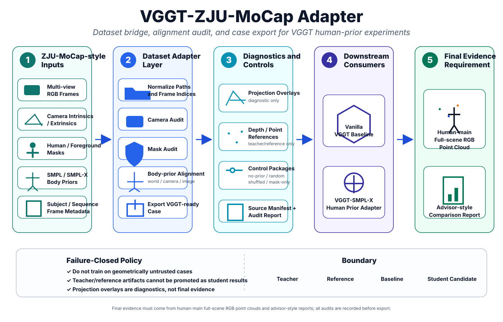

# VGGT-ZJU-MoCap Adapter

<p align="center">
  
</p>

## Route Position

This repository is the **dataset-bridge route** of the VGGT + SMPL-X project.

Its role is different from the model-side adapter. The focus here is not to design a new decoder or a new loss, but to make sure that the input case itself is geometrically trustworthy before it is sent to VGGT or to the human-prior branch.

Within the current project split:

- **`VGGT-ZJU-MoCap-Adapter`** prepares and audits ZJU-MoCap-style cases.
- **`VGGT-SMPL-X-Human-Prior-Adapter`** handles model-side prior injection.
- **`vggt_for_4k_4d`** organizes full-scene evidence and comparison outputs.

## Why This Route Is Necessary

A large part of the apparent model failure in multi-view human reconstruction is often a data-binding failure.

If frame indices are mismatched, if the camera convention is inconsistent, if masks leak too much background, or if the body prior is projected in the wrong coordinate system, the downstream model can appear unstable for reasons that do not really belong to the model itself.

This repository exists to reduce exactly that ambiguity.

It turns the ZJU-MoCap-style source data into a **VGGT-ready case** with explicit audit steps:

- path and frame normalization,
- camera audit,
- mask audit,
- body-prior alignment in world / camera / image space,
- export of diagnostics and manifests.

## What the Route Produces

The main output of this repository is not a final reconstruction figure. It is a **trusted case package**.

That package typically contains:

- multi-view RGB frames,
- camera intrinsics and extrinsics,
- human or foreground masks,
- SMPL / SMPL-X body-prior data,
- projection overlays for diagnostics,
- reference depth or point artifacts where needed,
- source manifests and audit reports.

This separation is important. The repository is meant to improve reliability upstream, not to over-claim success downstream.

## What We Check Before Export

A case is only useful if the different sources refer to the same person, the same frame, and the same geometry.

Before export, the following questions must be answerable:

- Do RGB frames and camera files use the same indexing?
- Are the intrinsics consistent with the exported image size?
- Is the world / camera transform convention explicitly fixed?
- Does the projected body prior overlap the human mask in each view?
- Is the scale and translation stable across the case?
- Are all inputs recorded in a source manifest?

If the answer is uncertain, the correct action is to stop and write a failure note, rather than to continue training on a geometrically untrusted case.

## Diagnostics and Controls

This repository also defines which auxiliary artifacts are allowed to exist around a case.

Useful diagnostics include:

- projection overlays,
- depth / point references,
- no-prior or mask-only exports,
- random-prior or shuffled-prior controls.

These are valuable for checking alignment and later ablation, but they should not be confused with final student evidence.

## Boundary of the Repository

This route intentionally maintains a strict boundary between **teacher**, **reference**, **baseline**, and **student candidate**.

- Teacher or reference artifacts help verify the geometry.
- The vanilla VGGT output remains a baseline.
- The student candidate is produced only after the audited case is consumed by the downstream model route.

This boundary avoids a common project mistake: showing a visually pleasing reference artifact and accidentally presenting it as a model result.

## Failure-Closed Policy

The repository follows a failure-closed policy.

If alignment does not hold, the pipeline should not quietly continue. Instead, it should:

1. stop export,
2. record the failure reason,
3. fix the camera / mask / body-prior binding,
4. rerun the audit.

This keeps later model comparisons meaningful.

## Current Status

At this stage, the repository should be read as the **data reliability layer** of the wider project.

Its contribution is not a final point-cloud headline result. Its contribution is that it makes later experiments interpretable: when the downstream model improves or fails, we can judge that result on a cleaner foundation.

## Figure

The architecture figure above is stored in:

```text
docs/figures/vggt_zju_mocap_adapter_architecture.svg
```
