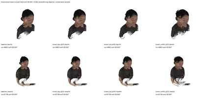

# VGGT-ZJU-MoCap Adapter

<p align="center">
  <b>A VGGT human-prior experiment data bridge for ZJU-MoCap-style data.</b>
</p>

<p align="center">
  Multi-view RGB · camera binding · mask audit · SMPL/SMPL-X prior alignment · VGGT-ready case export
</p>

<p align="center">
  <a href="README_CN.md">中文说明</a> ·
  <a href="#what-problem-this-repo-solves">What problem this repo solves</a> ·
  <a href="#pipeline">Pipeline</a> ·
  <a href="#parallel-engineering-notes">Parallel engineering notes</a> ·
  <a href="#current-result-snapshot">Result snapshot</a>
</p>

<p align="center">
  
  
  
  
</p>

<p align="center">
  
</p>

---

## What this repo is

`VGGT-ZJU-MoCap-Adapter` is the data reliability layer of the VGGT + human-prior project.

It does not package final results, and it does not treat diagnostic figures as achievements. This repository does one thing: it organizes ZJU-MoCap-style data into a trusted case that can be consumed by VGGT or a human-prior branch, while making the key parts clear: cameras, frame indices, masks, and body-prior projections.

Whether the downstream model has truly improved must be judged from a clean data entry point. This repository handles that entry point.

---

## What problem this repo solves

Common issues in multi-view human reconstruction include:

- RGB frames and camera files do not match;
- intrinsics are not updated after image resizing;
- world-to-camera and camera-to-world conventions are mixed;
- unstable mask boundaries affect the human region and scene context;
- SMPL / SMPL-X priors are projected to the wrong image location;
- teacher/reference artifacts are mistaken for student model outputs;
- projection overlays look correct, while the 3D point cloud still has not formed a reliable human shape.

This repository exposes these issues early. If the data layer is not trustworthy, the pipeline should stop here instead of continuing training, taking more screenshots, and pushing the problem further downstream.

---

## Project position

```text
ZJU-MoCap-style data
        │
        ▼
VGGT-ZJU-MoCap-Adapter
  ├─ path and frame-index normalization
  ├─ camera-parameter audit
  ├─ mask audit
  ├─ body-prior projection check
  ├─ diagnostic figures and control packages
  └─ VGGT-ready case package
        │
        ├─ vanilla VGGT baseline
        │
        └─ VGGT-SMPL-X Human Prior Adapter
              │
              ▼
      human-main full-scene RGB point-cloud evidence
```

Relation to other repositories:

- `VGGT-SMPL-X-Human-Prior-Adapter`: the model-side route for human-prior injection and training.
- `vggt_for_4k_4d`: the route for full-scene evidence, control results, and report-side comparisons.

This repository sits earlier in the chain. Its role is to turn ZJU-MoCap-style data into an input that can actually be discussed.

---

## Pipeline

### 1. Collect the case

The input usually contains multi-view RGB, camera parameters, masks, subject / sequence / frame information, and available SMPL or SMPL-X human-prior data.

### 2. Normalize frame indices and paths

Every exported sample should be traceable back to its original subject, sequence, camera id, frame id, and file path. The worst case here is that the pipeline runs, but no one can tell which frame was actually used.

### 3. Check cameras

Camera parameters are the foundation of multi-view geometry. Before export, intrinsics, extrinsics, coordinate conventions, image size, and resizing relationships need to be explicit. If this part is wrong, projection, depth, and point clouds will all be wrong afterward.

### 4. Check masks

Masks are not decorative images. They affect the human region, background retention, projection checks, and downstream supervision. If the mask itself is unreliable, even a visually pleasing model result should be treated carefully.

### 5. Align the human prior

SMPL / SMPL-X priors need to be projected back to the image through the same camera chain. Projection overlays are only used here as diagnostic figures to check whether the prior lands in a reasonable place. They cannot replace final 3D point-cloud evidence.

### 6. Export the VGGT-ready package

A case that passes the checks can enter the downstream routes: vanilla VGGT as the baseline, and the VGGT-SMPL-X human-prior branch for model-side experiments.

---

## Parallel engineering notes

This ZJU-MoCap adaptation work was later reviewed as part of a larger parallel engineering effort. The task moved from “connecting SMPL-X to VGGT” toward a more complete sparse-view human geometry recovery loop. Several routes were made runnable, while the upper bound of 6-view head / face point-cloud quality also became clearer.

The main chain can be summarized in four layers:

1. **Pose-aligned SMPL-X driver**: read pose / shape / expression / translation / scale, and place the parametric body into the current pose and scene coordinate system.
2. **Dense prior maps**: project the posed mesh into real cameras and generate view-aligned dense priors, including depth, camera/world points, normals, visibility, canonical coordinates, and body-part features.
3. **Input-side / layer-wise fusion**: RGB keeps real appearance and scene context; prior maps provide pose-aligned geometric positions; masks restrict where the human prior should take effect. The prior is not only concatenated once at the input side, but also participates during multi-layer feature evolution.
4. **Output-side supervision**: the training side supports depth / point / normal / point-normal geometric supervision, with ROI and boundary weighting.

The role of SMPL / SMPL-X here is not to serve as the final result. It is a pose-aligned geometry prior that provides coarse body position, depth, surface direction, and region constraints. The real question is still whether the downstream model can generate a clearer, more continuous, and more stable 3D human point cloud under sparse-view conditions.

This stage also made one lesson clear: adding more losses or increasing ROI point count does not automatically mean better geometry. If the teacher is not continuous, aligned, and complete enough on visible surfaces, the result can easily become a pseudo-positive case where point count increases but Open3D evaluation becomes worse.

---

## Checked routes and failure boundaries

The parallel experiments checked several directions:

- projected targetpatch / summary-token patch;
- point-normal / humancrop finetuning from the same checkpoint;
- TeacherGeom / ROI combo;
- confidence-collapse pseudo-positive cases, where face ROI point count increases but confidence thresholding or Open3D evaluation shows worse geometry;
- external teacher routes such as NormalBae, Sapiens, DepthAnything, and DepthPro.

The conclusion is fairly clear: the current bottleneck is not a lack of scripts. It is the lack of a high-quality, continuous, aligned head / face geometry teacher, or the lack of a local geometry optimization method that can directly improve sparse-view target-view surfaces.

The next route therefore has to move toward harder components:

- real 3D learned residual;
- multi-view detail supervision;
- baseline high-confidence detail preservation;
- SMPL feature-conditioned local geometry branch;
- human-main full-scene visual gate.

---

## Current result snapshot

<p align="center">
  
</p>

<p align="center"><sub>6-view face/head ROI re-audit: local facial structure is visible, but continuity and stability are still not enough.</sub></p>

<p align="center">
  
</p>

<p align="center"><sub>Kinect direct fusion conservative-parameter control: recorded as an external geometry route check, not as student output.</sub></p>

The safe conclusion at this point is that the 6-view setting has produced promising local facial results, but flaws remain. Under the same protocol, the 6-view face / head point cloud has not yet reached the final requirement of being clear, continuous, and stable enough.

---

## Project value

The work based on the ZJU-MoCap dataset gave us a useful stepping stone for getting familiar with VGGT and exploring human feed-forward priors. It exposed many engineering issues that are easy to miss: data binding, background interference, camera-chain reliability, mask quality, diagnostic-figure misjudgment, and the evaluation method for 3D main figures.

These issues pushed the later route change. What was missing was not a single script, but a more reliable model representation, training objective, local detail generation path, and 3D main-figure evaluation system.

Following the advisor's suggestion, later work introduced the 4K4D dataset and SMPL-X, and moved toward a more complete VGGT + SMPL-X human-prior experiment stack.

---

## Current status

This repository is currently positioned as a research utility / dataset bridge, not as a final point-cloud reconstruction benchmark.

The current focus is to make ZJU-MoCap-style cases auditable and reusable, while keeping the parallel engineering records, result snapshots, and failure boundaries visible.

---

## Data note

This repository is designed around local ZJU-MoCap-style data and human model assets. Restricted datasets, RGB frames, masks, camera files, and SMPL/SMPL-X body model files should not be placed directly in the public repository unless their licenses explicitly allow redistribution.

---

## Architecture figure and added figures

The architecture figure and the newly added supporting figures are stored at:

```text
docs/figures/vggt_zju_mocap_adapter_architecture.svg
docs/figures/yuque_parallel_face_head_results.svg
docs/figures/yuque_kinect_fusion_control_grid.svg
```
